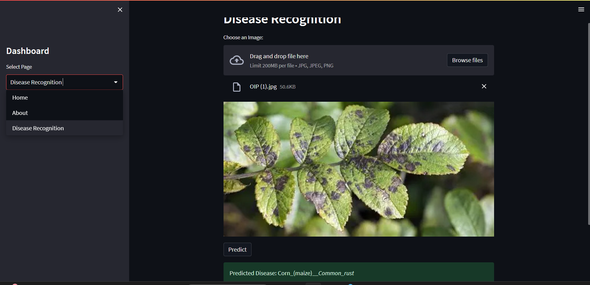

# 🌱 Plant Disease Prediction using Deep Learning

[](LICENSE)
[]()
[]()
[]()
[]()
[]()

A deep learning web application to predict plant diseases from leaf images.  
Built using **TensorFlow, Keras, and Streamlit**.

---

## 🚀 Features
- Upload plant leaf image (jpg, png, jpeg).  
- Predicts disease using a trained CNN model.  
- Covers **38 different classes** from the PlantVillage dataset.  
- Easy-to-use web dashboard.  

---

## 📂 Project Structure

Plant_Disease_Prediction/

main.py # Streamlit app
requirements.txt # Dependencies
trained_model.h5/.keras # CNN model
README.md # Project description
LICENSE # MIT License
.gitignore # Ignore unwanted files
images/ # Screenshots
notebooks/ # Training notebooks
venv/ # Virtual environment (ignored in git)

---


---

## 📸 Screenshots


---

## 🧠 Dataset
- **PlantVillage Dataset** 🌿  
- ~87,000 images, 38 classes (healthy + diseased leaves)  
- Crops: Apple, Corn, Grape, Tomato, Potato, etc.

---


🔮 Future Scope

🔑 User login & registration system

🌐 Multilingual support (English, Hindi, etc.)

📜 Prediction history for each user

---

👨‍💻 Author

Ayush Raghuwanshi
🎓 B.Tech CSE (IoT)
📧 Email: ayushraghuwanshi.dev@gmail.com

🔗 GitHub: Ayush-Raghuwanshi-Dev

---

🙏 Credits

Special thanks to SPOTLESS TECH 🎥
for guidance and tutorials that inspired this project.


## ⚙️ How to Run
```bash
# Clone the repo
git clone https://github.com/Ayush-Raghuwanshi-Dev/Plant_Disease_Prediction.git
cd Plant_Disease_Prediction

# Create virtual environment
python -m venv venv
venv\Scripts\activate      # (Windows)
source venv/bin/activate   # (Linux/Mac)

# Install dependencies
pip install -r requirements.txt

# Run the app
streamlit run main.py

----
